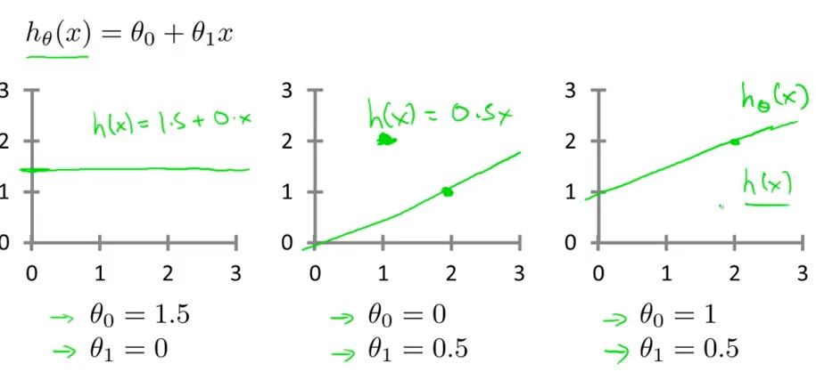
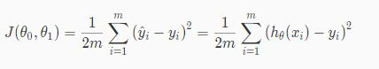

### Linear Regression with One Variable

Terminology
- m = number of training examples
- x = input variables / features
- y = output variables / target variables
- (x,y) = single training examples (i.e row in table)
- xi, yi = ith training example (range: i-m)
- h = hypothesis function

### Representation of supervised algorithm
h maps from x's to y's.
```
                Training Set
                     |
             Learning Algorithm
                     |
size of house (x) => h => estimated price (y)  
```
Linear regression with one variable or univariable linear regression.

- How to represent hypothesis?
- h_theta(x) = theta(0) + theta(1)x (theta is used for constants, and special variables)
- shorthand = h(x)
- h function simply maps x's to y's linearly (for the housing example)
- <b>h: X -> Y</b>

### Cost function
- h_theta(x) = theta_0 + theta_1(x) (theta is used for constants, and special variables)
- h(x) is thus a linear function:


- how we figure out theta parameters
- in linear regression we are trying to identify theta0 and theta1 that fits to data
- how can we measure accuracy of these parameters
- We want to minimize variance for our training set!

- we do this using the cost function

- it is mean squared error function: 1/2 (mean of squares of h(x) - y)
- Remember that mean of squares of h(x) - y, is variance measure that emphasizes extremes, and average (sum(xi)/m) reduces square variance. - We take half of that "as a convenience for computation of the gradient descent, as the derivative term of the square function will cancel out the 1/2 term."
    - d(x^2)/dx = 2x. So d(x^2)/dx * 1/2(mean of square var) = 1 coeff.
- so this function is an inuitive way to look at spread of variance data, that emphasizes high extremes

```python
"""
minimize th0, th1
using the squared error function
This J(th0,th1) is the cost function.
"""

#for i=range(1,m):
J(th0,th1) = 0.5 * sum( (h(x[i]) - y[i])^2 )/m # minimize the square difference
```

### Cost function Intuition 1

- We simplify the linear formula to a single variable: `h(x) =  theta * x`
- Then for a given set of data (3 points on a graph which is y = x), we estimate variance for a line h(x) with different theta values. i.e for a theta of 1, h(x) = x = y, so variance is 0.
- For theta of 2, variance increases by square because mean square error. Thus, from J(theta) = 0, both sides gets drawn as a parabolic arc.

- So the value of theta that is minimum is theta = 1, which is in fact the best fit.
- intuition of cost function: it "punishes" larger variation

### Cost function Intuition 2

Hypothesis: htheta(x) = theta_0 + theta_1
Cost function: J(t0,ti) = 1/2m sum( ht(x) - y)^2 )
- where x is the values of the parameters we are testing, and y is the training dataset we are comparing against
- for two parameters, we use contour plots
- rather then parabolic line, we get a 3d rotated, parabolic "bowl"
